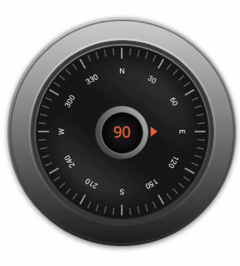

# How-to-set-a-graphical-frame-image-as-a-background-of-the-.NET-MAUI-Radial-Gauge
This article describes how to set a graphical frame image as a background of the [Syncfusion .NET MAUI Radial Gauge](https://www.syncfusion.com/maui-controls/maui-radial-gauge) control.

You can show any visual content as a background of [SfRadialGauge](https://help.syncfusion.com/cr/maui/Syncfusion.Maui.Gauges.SfRadialGauge.html) using the [BackgroundContent](https://help.syncfusion.com/cr/maui/Syncfusion.Maui.Gauges.RadialAxis.html#Syncfusion_Maui_Gauges_RadialAxis_BackgroundContent)
property of [RadialAxis](https://help.syncfusion.com/cr/maui/Syncfusion.Maui.Gauges.RadialAxis.html).

**Step 1:** Adding an image to the project

Add the required graphical frame image to the Resources/Images path in your .NET MAUI project. You can access the image using their name.

To know more about working with images in .NET MAUI, [click here](https://docs.microsoft.com/en-us/dotnet/maui/user-interface/controls/image).

**Step 2:** Set a graphical frame image to the background of the radial axis

Create the radial gauge control by referring to the getting started [link](https://help.syncfusion.com/maui/radialgauge/getting-started#creating-an-application-using-the-net-maui-radial-gauge) and set the corresponding image to the [BackgroundContent](https://help.syncfusion.com/cr/maui/Syncfusion.Maui.Gauges.RadialAxis.html#Syncfusion_Maui_Gauges_RadialAxis_BackgroundContent) property as demonstrated in the following code example.

[C#]
```
<gauge:SfRadialGauge>
        <gauge:SfRadialGauge.Axes>
            <gauge:RadialAxis … >
               …
                <gauge:RadialAxis.BackgroundContent>
                    <Image Source="dark_theme_gauge.png"/>
                </gauge:RadialAxis.BackgroundContent>
            </gauge:RadialAxis>
        </gauge:SfRadialGauge.Axes>
 </gauge:SfRadialGauge>

```

[Output]



## See also

[How to create an application using the .NET MAUI Radial Gauge?](https://help.syncfusion.com/maui/radialgauge/getting-started#creating-an-application-using-the-net-maui-radial-gauge)

[How to customize Axis?](https://help.syncfusion.com/maui/radialgauge/axes#axis-customization)

[How to customize Axis Label?](https://help.syncfusion.com/maui/radialgauge/axes?cs-save-lang=1&cs-lang=csharp#axis-label-customization)

[How to customize Axis Label using Label Created Event?](https://help.syncfusion.com/maui/radialgauge/axes?cs-save-lang=1&cs-lang=csharp#labelcreated)

[How to customize Ticks?](https://help.syncfusion.com/maui/radialgauge/axes?cs-save-lang=1&cs-lang=csharp#tick-customization)

[How to position and customize annotation?](https://help.syncfusion.com/maui/radialgauge/annotation)
